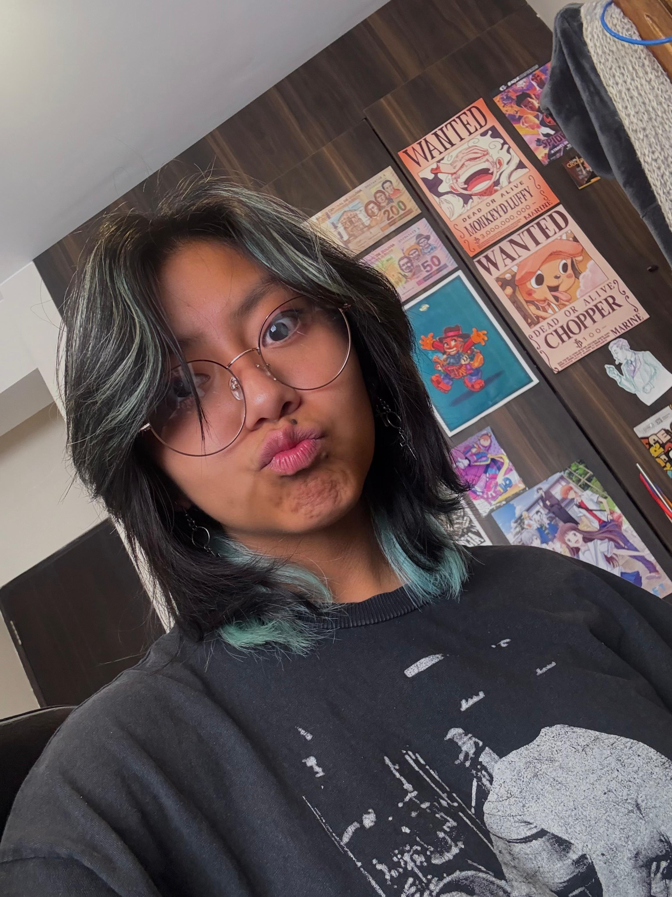
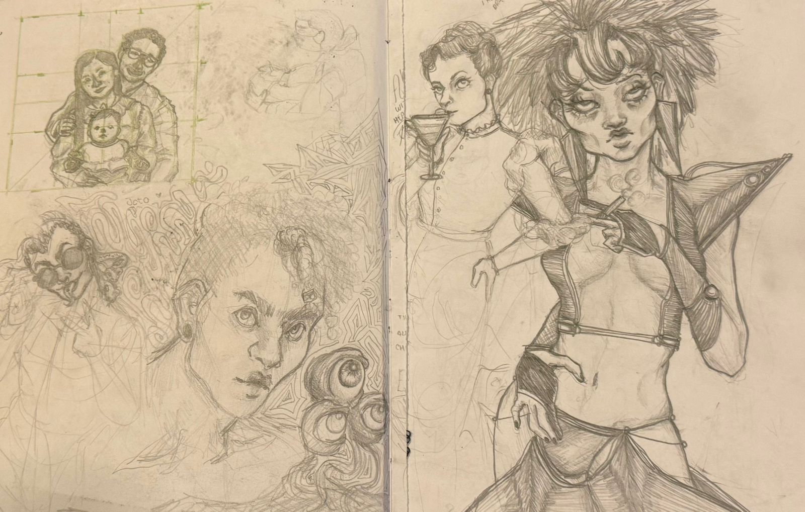

# Biografía

## Un poquito sobre mí

¡Saludos! Mi nombre es **Valeria Fernández (ella)** o **Val** para abreviar. Actualmente tengo 18 años, soy estudiante de segundo semestre en la carrera de Ingeniería en Sistemas (La Paz, Bolivia) y me encanta todo lo que involucra el arte, el folclore boliviano y *pop culture*. 

Ahora que lo veo escrito, sí parece una combinación algo aleatoria. Dejando de lado el breve desvío, me encanta encontrar y participar en distintas comunidades. Siempre me intrigó el concepto de crear lazos y realizar actividades interesantes simplemente porque compartimos algo en común. ¡Espero continuar haciendo lo mismo con ustedes, Pythonistas!

## Hobbies

1. Dibujar, pintar y realizar bocetos de personajes de series o películas que se vuelven mi hiperfijación por una semana.
2. Aprender sobre lenguajes de programación.
3. Sacar fotografías amateur.
4. Buscar *uploads* ilegales de musicales de en Broadway u Off Broadway.
5. Repetir todo el playlist de **Siglo XX** de Carlos de Mesa en YouTube.

## Gustitos principales o típicamente preguntados

- Comida favorita: hamburguesas o p'isqi.
- Color favorito: azul y sus variaciones.
- Artista musical favorita: Kimya Dawson.
- Canción favorita: Qhunuskiwa (específicamente la interpretación de Música de Maestros).
- Películas favoritas: *The Hunchback of Notre Dame* (1996) o *Juno* (2007).
- Actividad favorita: dibujar o pasear por la ciudad.
- Metas: viajar y conocer nuevos lugares, graduarme de la carrera, empezar y/o culminar proyectos personales de arte y/o programación, etc.

>I am just a speck of dust inside a giant's eye - (Kimya Dawson, "I like Giants")

## Algunas fotografías

