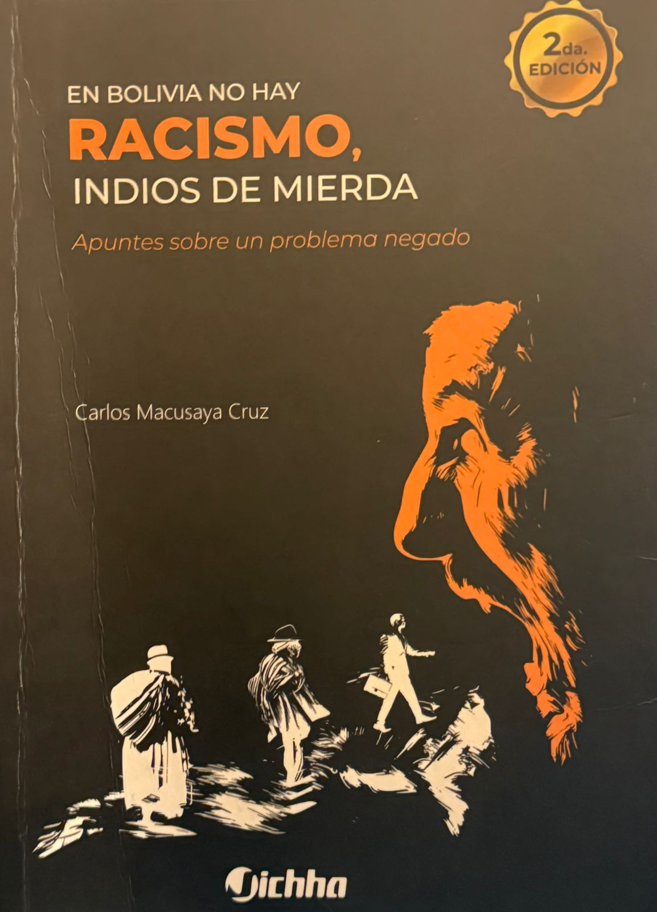
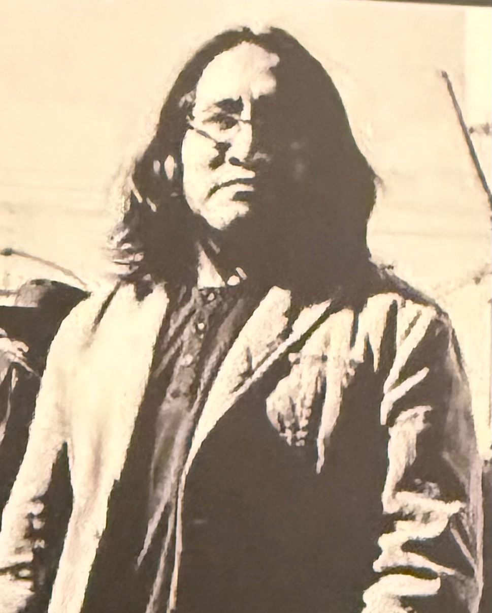

# Mi Libro Favorito

## Título del libro
**En Bolivia No Hay Racismo Indios De  ~~Mierda~~** – *Carlos Macusaya Cruz* 

## Enlaces recomendadas
[Una reseña del libro](https://oxxxi.wordpress.com/2020/08/17/resena-en-torno-a-en-bolivia-no-hay-racismo-indios-de-mierda-de-carlos-macusaya-por-wim-kamerbeek/) 

[Biblioteca de la Editorial Jichha](https://jichha.blogspot.com/2014/08/biblioteca.html)

## Impresión personal
Aunque el autor resulta relativamente polémico en la actualidad (al igual que el título del libro) y aún no lo he concluido por completo, debo decir que ha sido una lectura muy impactante.  
El texto aborda distintos puntos sobre la racialización en Bolivia, tocando temas que suelen ser incómodos de conversar para el ciudadano cotidiano.  Asimismo, provee una introducción científica/biólogica sobre lo que nosotros podríamos percibir como raza. Facilitando la transición para el lector a conceptualizaciones de raza que tornan al lado de las ciencias sociales.
A pesar de no ser una obra académica (considerándolo más bien un ensayo o un artículo extenso), la forma de escribir de Carlos Macusaya es fácil de entender, (a veces) sarcástica y graciosa en varias secciones.  
El libro realmente te atrapa, y lo valioso es que te invita a detenerte un momento para identificar y cuestionar tu identidad y tu posición en una sociedad que aún mantiene rasgos de casta profundamente arraigados.

## Capítulos recomendados
### Identidad nacional, orden social y movilidad
- La nación mestiza … pág(62)  
- La identidad nacional y el indio … pág(65)  
- Orden y movilidad social … pág(68)  
- Individualidad y “lo indio” … pág(73)  
- “Trastornos” de la nación … pág(76)  

### Virginidad cultural y defensa de "lo propio"
1. Autenticidad indígena: virginidad cultural … pág(82)  
2. La defensa de “lo propio” … pág(86)  
3. Entre los “desvirginados” contra el racismo … pág(90)  
4. Jóvenes y “cultura indígena” … pág(94) 

## Imágenes
 
  

## Citas
 1. > Me interesa mostrar con esta anécdota que nuestra in-dividualidad, nuestro yo, nuestro sí mismo, es algo producido socialmente y que "en sí mismo", desvinculado de las relaciones sociales que lo determinan, es nada. La individualidad es un fenómeno social y sus peculiaridades responden a los contextos específicos en los que se produce.
> — Carlos Macusaya, *En Bolivia no hay racismo, indios de ~~mierda~~* (p. 76)

 2. > Una anécdota al respecto la escuché de un viejo militante "indio" de aquellos años. En una de las campañas que hicieron para una de esas elecciones se presentaron en la plaza de un pueblo y mientras el candidato indio discursaba, pidiendo el voto de sus hermanos, uno de ellos le interrumpió con estas palabras: "¿Cómo voy a votar por vos si como yo nomás eres?"
> — Carlos Macusaya, *En Bolivia no hay racismo, indios de ~~mierda~~* (p. 93)